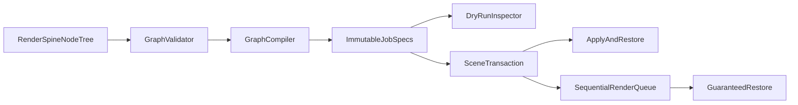

# RenderSpine: Goals and Implementation Plan

## Vision

RenderSpine is a standalone Blender 5.2 extension for designing render
setups as node graphs.

Its purpose is to replace scattered per-scene, per-view-layer, and per-render
property editing with reusable render jobs. A graph should describe what to
render, which settings to override, where output belongs, and which jobs run in
sequence.

The extension takes workflow ideas from
[RenderNode](https://github.com/atticus-lv/RenderNode) and the Blender community
[Render Nodes proposal](https://blender.community/c/rightclickselect/1phbbc/),
but uses a new Blender 5.2 implementation.

## Problems to solve

Blender render setup is spread across scene properties, view layers, object and
collection visibility, compositor settings, cameras, and output settings. This
creates several problems:

- render variants are difficult to understand at a glance;
- shared base settings must be copied across view layers or scenes;
- downstream overrides are hard to express and reuse;
- batch jobs often need separate addons or scripts;
- temporary changes can leak into the working scene after failure or cancel;
- old render automation frequently depends on unsafe Python evaluation;
- production teams lack a portable, inspectable render-setup asset.

RenderSpine should make those relationships visible and testable.

## Product goals

### 1. Job-oriented graphs

A graph compiles into one or more render jobs. Each job contains:

- source scene;
- camera, world, and view-layer selection;
- frame range and resolution;
- render engine and quality settings;
- output path and format;
- object, collection, material, transform, and action overrides;
- ordered metadata needed by validation and execution.

Settings later in a chain replace earlier values with the same target and path.
This supports reusable base setups followed by shot-specific overrides.

### 2. No mutation during graph editing

Adding, removing, linking, or editing nodes must not change Blender data.

Graph compilation is read-only. It produces immutable job specifications and
diagnostics. Scene mutation happens only after an explicit user action:

- **Preview** compiles and displays planned changes;
- **Apply** applies one selected job for inspection;
- **Restore** reverses the active Apply transaction;
- **Render Selected** renders one job and restores the scene;
- **Render All** runs compiled jobs sequentially and restores after each job.

### 3. Transactional safety

Execution captures only properties touched by a job. Changes restore in reverse
order after:

- successful render completion;
- user cancellation;
- Blender rejecting a render request;
- invalid target or RNA path;
- operator exception;
- addon disable or unregister.

The render interface is locked while transactional scene changes are active.

### 4. Blender 5.2-native implementation

The extension uses:

- `blender_manifest.toml` extension packaging;
- relative package imports and extension-safe namespaces;
- custom `NodeTree`, typed sockets, and Blender 5.2 node interfaces;
- `draw_color_simple` for socket colors;
- `NODE_MT_add` menu integration;
- current Eevee, Cycles, render, and view-layer APIs;
- explicit registration and reverse-order unregister.

Removed APIs such as `bgl`, `Scene.node_tree`, and old Eevee settings are not
carried forward.

### 5. Production testability

Core graph models and compiler behavior remain deterministic. Automated Blender
5.2 tests cover:

- extension registration and unregister;
- every production node and socket;
- deterministic graph compilation;
- cycle and invalid-graph diagnostics;
- reusable job groups;
- scene and datablock transaction round trips;
- render-complete and render-cancel restoration;
- a real minimal render;
- manifest validation and extension archive build.

## Non-goals for version 1.0

Version 1.0 intentionally excludes:

- arbitrary Python script nodes;
- arbitrary property paths implemented with `eval` or `exec`;
- runtime `pip` or dependency installation;
- SMTP and render-complete email;
- custom OpenGL node overlays;
- old Eevee Bloom, GTAO, and screen-space-reflection controls;
- automatic legacy compositor construction;
- external render-farm management;
- Workbench-specific quality tuning;
- direct compatibility with old RenderNode `.blend` graphs.

These exclusions reduce security, migration, and maintenance risk.

## Architecture



### Graph layer

Location: `addons/render_spine/core/`, `tree.py`, and `sockets.py`.

Responsibilities:

- define pure `Override`, `JobSpec`, `JobList`, `Diagnostic`, and
  `CompileResult` values;
- validate link compatibility and node constraints;
- find enabled job outputs;
- evaluate dependencies once in deterministic order;
- detect cycles;
- compile without changing Blender data;
- provide strict and diagnostic-returning modes.

### Node layer

Location: `addons/render_spine/nodes/`.

Node categories:

- **Values**: bool, int, float, string, vector, object, material, collection,
  scene, world, action;
- **Jobs**: seed, list, index, single output, list output;
- **Settings**: camera, world, view layer, engine, Cycles/Eevee samples,
  current settings, frame range, resolution, output path/format, film, color
  management, simplify;
- **Objects and Collections**: visibility, transform, material, action,
  collection visibility;
- **Utility**: switch, safe boolean/math/string operations;
- **Groups**: reusable render graphs applied as a job override layer.

Each setting node receives a job and emits a new job. It never writes to the
scene.

### Execution layer

Location: `addons/render_spine/execution/`.

Responsibilities:

- adapt compiler output to operators and UI;
- resolve scene and datablock targets;
- parse a restricted RNA path grammar without executing code;
- clone old values and apply ordered overrides;
- restore changes in reverse order;
- own active Apply and render transactions;
- run selected or all jobs sequentially;
- monitor Blender render-complete and render-cancel handlers;
- create required output directories;
- restore window scene and interface-lock state.

### Operator and UI layer

Location: `operators.py`, `state.py`, and `ui.py`.

Responsibilities:

- expose Preview, Apply, Restore, Render Selected, Render All, and Cancel;
- store compile status, selected job, queue position, output path, and errors;
- display controls in Node Editor header and RenderSpine sidebar;
- show dry-run job and override summaries;
- prevent conflicting actions during active rendering.

## Implementation phases

### Phase 1: Extension scaffold

1. Create `addons/render_spine/`.
2. Add Blender 5.2 manifest and Apache-2.0 notices.
3. Use explicit registration order.
4. Add `install.ps1` with a development extension junction.

Status: complete.

### Phase 2: Deterministic graph core

1. Define immutable job and diagnostic models.
2. Implement typed sockets and custom render node tree.
3. Implement graph validation, dependency traversal, caching, and cycles.
4. Add production value, job, setting, object, collection, utility, and group
   nodes.
5. Verify graph compilation performs no scene writes.

Status: complete.

### Phase 3: Transactional execution

1. Define restricted, parsed RNA operations.
2. Resolve scene and named datablock targets.
3. Capture touched values.
4. Apply selected jobs.
5. Restore in reverse order.
6. Add sequential selected/all render queue.
7. Handle completion, cancel, exception, and unregister cleanup.
8. Lock and restore Blender render interface state.

Status: complete.

### Phase 4: UI and diagnostics

1. Add Node Editor menus and categories.
2. Add compile and dry-run controls.
3. Show selected job, output status, queue progress, and errors.
4. Add Apply/Restore and render actions.
5. Document first graph and safety model.

Status: complete.

### Phase 5: Verification and packaging

1. Validate source manifest.
2. Register and unregister twice under factory startup.
3. Instantiate all production nodes and sockets.
4. Compile static, grouped, and cyclic graphs.
5. Test scene/object/collection/material/action restoration.
6. Test queue completion and cancellation paths.
7. Write a real tiny render and restore original settings.
8. Build and validate `render_spine-1.0.0.zip`.
9. Complete manual Blender UI acceptance checklist.

Automated status: complete. Manual checklist:
[`render-spine-acceptance.md`](render-spine-acceptance.md).

## Version 1.0 acceptance criteria

Version 1.0 is ready when:

- Blender 5.2 loads the extension through its extension namespace;
- all production nodes register and persist in `.blend` files;
- valid graphs compile deterministically;
- invalid graphs produce actionable errors;
- graph editing leaves scene data unchanged;
- Apply can be restored;
- every render restores after completion, cancellation, and failure;
- source and built package validation pass;
- headless test suite passes;
- manual UI workflow passes.

Run automated verification from repository root:

```powershell
.\test-render-spine.ps1
```

## Reference and migration policy

Behavior was informed by upstream RenderNode (Atticus). This personal repo does
not vendor an upstream snapshot; compare against
https://github.com/atticus-lv/RenderNode when needed. The extension must never
import upstream code at runtime.

Porting decisions for upstream modules are documented in
[`render-spine-port-map.md`](render-spine-port-map.md).

When adapting upstream behavior:

- use RenderSpine IDs and namespaces (`RSP_`, `rsp.*`, `RenderSpineNode*`);
- preserve required attribution (`NOTICE`, `THIRD_PARTY_NOTICES`);
- replace unsafe dynamic execution with structured operations;
- prefer current Blender APIs over compatibility shims;
- add a test for each restored behavior;
- mark intentionally deferred behavior in the port map.

## Post-1.0 roadmap

Potential later work, prioritized only after production feedback:

1. dynamic-length job lists and variant cross-products;
2. richer output-path tokens and collision previews;
3. view-layer collection exclusion controls;
4. compositor output templates using Blender 5.2 compositor APIs;
5. background-process and multi-file queues;
6. render presets as Blender assets;
7. graph migration/versioning;
8. Workbench controls;
9. editor convenience shortcuts and pie menus;
10. render-farm adapters built on compiled job specifications.

Future work must preserve deterministic compilation and transactional restore as
non-negotiable design constraints.
